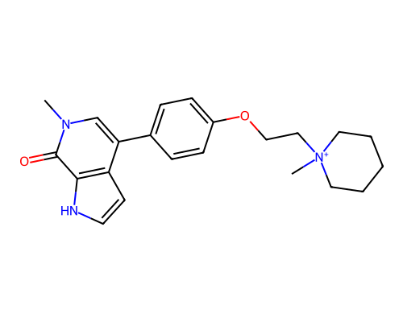
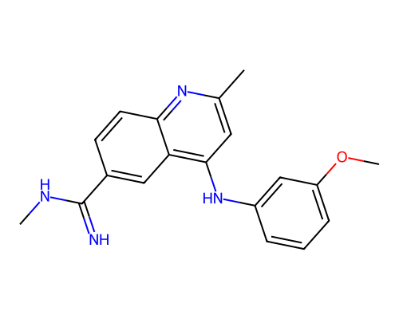
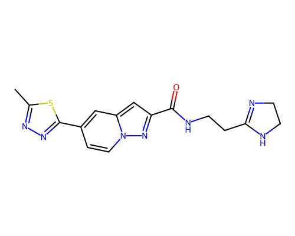
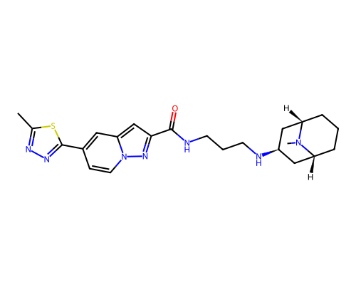
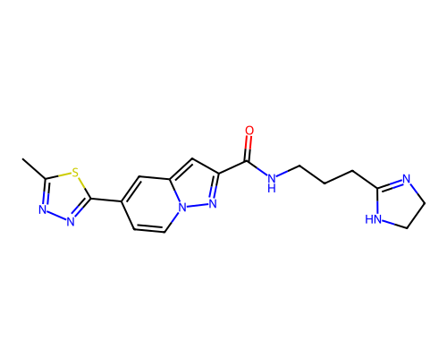
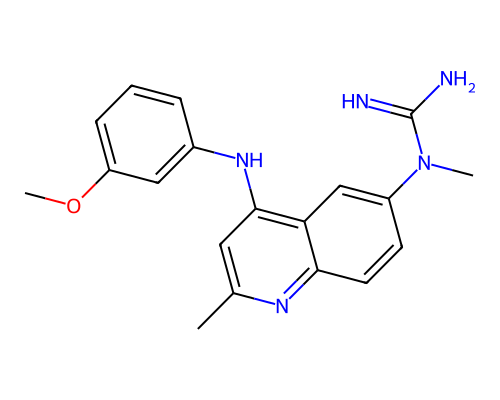
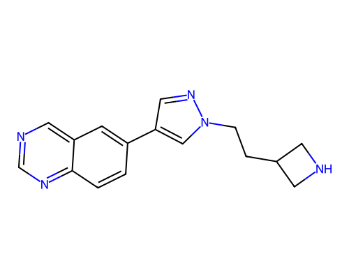

# Error analysis — worst 10 predictions on ExpansionRx

## Reliability coverage (full test set)

- Total valid compounds: 5039
- Flagged reliable: 3706 (73.5%)
- Precision on reliable subset (|error| <= 1.0 log unit): 81.0%
- RMSE overall: 0.824, RMSE on reliable subset: 0.791

## Worst-10 analysis

- Median ensemble std across full test: 0.131 log units
- Reliability thresholds: std <= 0.166, Tanimoto >= 0.250
- Of the worst 10: **3/10 would have been flagged unreliable** (loud), **7 silent failures**

## Per-compound breakdown

### 1. abs_error = 3.18 log units

- SMILES: `Cn1cc(-c2ccc(OCC[N+]3(C)CCCCC3)cc2)c2cc[nH]c2c1=O`
- True: -1.50, Predicted: 1.68
- Ensemble std: 0.115, Nearest-training Tanimoto: 0.313
- Conformal ±1.20 (covers truth: NO)
- Would reliability flag fire: NO (silent failure — blind spot)

**Rationale:** Permanent positive charge (quaternary nitrogen) — logd is dominated by the ionic species at ph 7.4; the model counts this group but lacks the pka magnitude to quantify the shift. aromatic basic nitrogen(s) (pKa ~3-5) — weakly basic heterocyclic nitrogens, individually not strongly ionised at pH 7.4 but multiple instances shift the protonation equilibrium.

### 2. abs_error = 3.16 log units

- SMILES: `CNC(=N)c1ccc2nc(C)cc(Nc3cccc(OC)c3)c2c1`
- True: -0.50, Predicted: 2.66
- Ensemble std: 0.216, Nearest-training Tanimoto: 0.446
- Conformal ±1.20 (covers truth: NO)
- Would reliability flag fire: YES (loud failure — system knew)

**Rationale:** Amidine group (pka ~10-11, protonated at ph 7.4) — the cationic form dominates partitioning; the model counts this group but lacks pka-derived features to quantify the logd shift. aromatic basic nitrogen(s) (pKa ~3-5) — weakly basic heterocyclic nitrogens, individually not strongly ionised at pH 7.4 but multiple instances shift the protonation equilibrium. high ensemble disagreement (std=0.22 vs median 0.13) — model internals knew this was uncertain.

### 3. abs_error = 3.09 log units

- SMILES: `CNC(=N)c1ccc2nc(N(C)C)cc(Nc3cccc(OC)c3)c2c1`
- True: -0.30, Predicted: 2.79
- Ensemble std: 0.304, Nearest-training Tanimoto: 0.347
- Conformal ±1.20 (covers truth: NO)
- Would reliability flag fire: YES (loud failure — system knew)

**Rationale:** Amidine group (pka ~10-11, protonated at ph 7.4) — the cationic form dominates partitioning; the model counts this group but lacks pka-derived features to quantify the logd shift. aromatic basic nitrogen(s) (pKa ~3-5) — weakly basic heterocyclic nitrogens, individually not strongly ionised at pH 7.4 but multiple instances shift the protonation equilibrium. high ensemble disagreement (std=0.30 vs median 0.13) — model internals knew this was uncertain.

### 4. abs_error = 3.08 log units

- SMILES: `CNc1ccnc(N(CCc2ccncc2)c2ccnc(Nc3ccc(OC)cc3)n2)n1`
- True: -0.60, Predicted: 2.48
- Ensemble std: 0.143, Nearest-training Tanimoto: 0.368
- Conformal ±1.20 (covers truth: NO)
- Would reliability flag fire: NO (silent failure — blind spot)

**Rationale:** Aminopyrimidine group (pka ~4-6) — weakly basic heterocyclic nitrogen, individually not strongly ionised at ph 7.4 but multiple instances shift the protonation equilibrium. basic amine (pKa ~9-10, protonated at pH 7.4) — the model counts this group but lacks pKa-derived features to quantify the logD shift from ionisation.

### 5. abs_error = 3.01 log units

- SMILES: `Cc1nnc(-c2ccn3nc(C(=O)NCCC4=NCCN4)cc3c2)s1`
- True: -2.00, Predicted: 1.01
- Ensemble std: 0.133, Nearest-training Tanimoto: 0.275
- Conformal ±1.20 (covers truth: NO)
- Would reliability flag fire: NO (silent failure — blind spot)

**Rationale:** Amidine group (pka ~10-11, protonated at ph 7.4) — the cationic form dominates partitioning; the model counts this group but lacks pka-derived features to quantify the logd shift. multiple (3) aromatic basic nitrogen(s) (pKa ~3-5) — weakly basic heterocyclic nitrogens, individually not strongly ionised at pH 7.4 but multiple instances shift the protonation equilibrium. far from training distribution (max Tanimoto to train = 0.28) — applicability-domain check correctly flags this as extrapolation.

### 6. abs_error = 2.99 log units

- SMILES: `Cc1nnc(-c2ccn3nc(C(=O)NCCCN[C@@H]4C[C@H]5CCC[C@@H](C4)N5C)cc3c2)s1`
- True: -1.50, Predicted: 1.49
- Ensemble std: 0.155, Nearest-training Tanimoto: 0.338
- Conformal ±1.20 (covers truth: NO)
- Would reliability flag fire: NO (silent failure — blind spot)

**Rationale:** Multiple (3) aromatic basic nitrogen(s) (pka ~3-5) — weakly basic heterocyclic nitrogens, individually not strongly ionised at ph 7.4 but multiple instances shift the protonation equilibrium. basic amine (pKa ~9-10, protonated at pH 7.4) — the model counts this group but lacks pKa-derived features to quantify the logD shift from ionisation.

### 7. abs_error = 2.98 log units

- SMILES: `Cn1cc(C[N+]2(CCCn3ccc4c5cc(O)ccc5n(C)c4c3=O)CCCCC2)cn1`
- True: -1.20, Predicted: 1.78
- Ensemble std: 0.124, Nearest-training Tanimoto: 0.256
- Conformal ±1.20 (covers truth: NO)
- Would reliability flag fire: NO (silent failure — blind spot)

**Rationale:** Permanent positive charge (quaternary nitrogen) — logd is dominated by the ionic species at ph 7.4; the model counts this group but lacks the pka magnitude to quantify the shift. multiple (4) aromatic basic nitrogen(s) (pKa ~3-5) — weakly basic heterocyclic nitrogens, individually not strongly ionised at pH 7.4 but multiple instances shift the protonation equilibrium. far from training distribution (max Tanimoto to train = 0.26) — applicability-domain check correctly flags this as extrapolation.

### 8. abs_error = 2.97 log units

- SMILES: `Cc1nnc(-c2ccn3nc(C(=O)NCCCC4=NCCN4)cc3c2)s1`
- True: -1.90, Predicted: 1.07
- Ensemble std: 0.140, Nearest-training Tanimoto: 0.256
- Conformal ±1.20 (covers truth: NO)
- Would reliability flag fire: NO (silent failure — blind spot)

**Rationale:** Amidine group (pka ~10-11, protonated at ph 7.4) — the cationic form dominates partitioning; the model counts this group but lacks pka-derived features to quantify the logd shift. multiple (3) aromatic basic nitrogen(s) (pKa ~3-5) — weakly basic heterocyclic nitrogens, individually not strongly ionised at pH 7.4 but multiple instances shift the protonation equilibrium. far from training distribution (max Tanimoto to train = 0.26) — applicability-domain check correctly flags this as extrapolation.

### 9. abs_error = 2.96 log units

- SMILES: `COc1cccc(Nc2cc(C)nc3ccc(N(C)C(=N)N)cc23)c1`
- True: -0.70, Predicted: 2.26
- Ensemble std: 0.291, Nearest-training Tanimoto: 0.438
- Conformal ±1.20 (covers truth: NO)
- Would reliability flag fire: YES (loud failure — system knew)

**Rationale:** Guanidine group (pka ~12-13, fully protonated at ph 7.4) — the cationic form dominates partitioning; the model counts this group but lacks pka-derived features to quantify the logd shift. aromatic basic nitrogen(s) (pKa ~3-5) — weakly basic heterocyclic nitrogens, individually not strongly ionised at pH 7.4 but multiple instances shift the protonation equilibrium. high ensemble disagreement (std=0.29 vs median 0.13) — model internals knew this was uncertain.

### 10. abs_error = 2.92 log units

- SMILES: `c1ncc2cc(-c3cnn(CCC4CNC4)c3)ccc2n1`
- True: -1.70, Predicted: 1.22
- Ensemble std: 0.096, Nearest-training Tanimoto: 0.293
- Conformal ±1.20 (covers truth: NO)
- Would reliability flag fire: NO (silent failure — blind spot)

**Rationale:** Multiple (4) aromatic basic nitrogen(s) (pka ~3-5) — weakly basic heterocyclic nitrogens, individually not strongly ionised at ph 7.4 but multiple instances shift the protonation equilibrium. basic amine (pKa ~9-10, protonated at pH 7.4) — the model counts this group but lacks pKa-derived features to quantify the logD shift from ionisation. far from training distribution (max Tanimoto to train = 0.29) — applicability-domain check correctly flags this as extrapolation.
